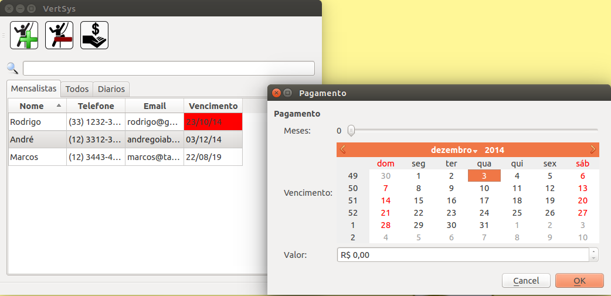

VertSys
=======

QT application to manage climbers in a gym

Made using QT 4 and SQLite

Current Features:

* Add/Remove Climber.
* Pay.
* Import/Export database.
* Edit Climbers.
* Reports.
* Export emails

TODO:

* Translation
* Improve payment method
* Account manager
* Reuse register code to edit climbers
* Make a instaler [InstalerFramework]
* Send email notifications. Maybe using this [SmtpClient-for-Qt]

Example:

[SmtpClient-for-Qt]: https://github.com/bluetiger9/SmtpClient-for-Qt
[InstalerFramework]: http://qt-project.org/doc/qtinstallerframework-1.5/index.html
